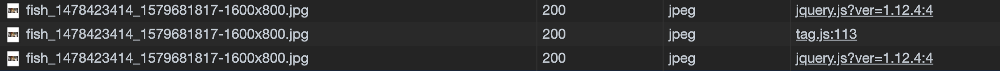
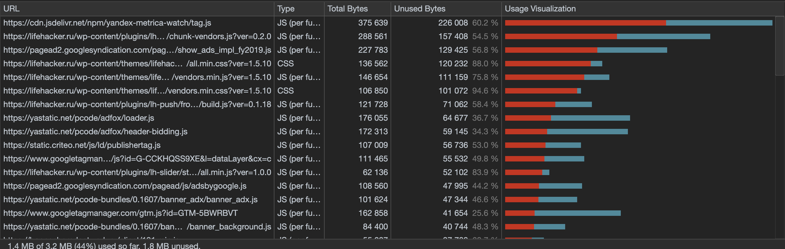

## <a href="https://lifehacker.ru" target="_blank">https://lifehacker.ru</a>

___
### Вкладка Network
* найти неоптимальные места:
    * дублирование ресурсов
    
        Различные скрипты, изображения
        
        
        
        
        
        
        
        
        
        
        
        
        
        
        
        
        
        
        
        
        
        
    * лишний размер ресурса
    
        Неоптимизированные изображения
        
    * медленно загружающиеся ресурсы
    
        Какая-то дичь    
        
    * ресурсы, блокирующие загрузку
    
        Скрипты, стили, как обычно
         

---
### Вкладка Performance
* записать и сохранить в файл профиль загрузки страницы
* измерить время в миллисекундах от начала навигации до событий 
    * First Paint - 719.3ms
    * First Meaningful Paint - 814.1ms
    * DOM Content Loaded - 1775.9ms
    * Load - 6930.8ms
* измерить, сколько времени в миллисекундах тратится на разные этапы обработки документа 
     

---
### Вкладка Coverage

 

* измерить в килобайтах объём неиспользованного CSS в ходе загрузки страницы

    400,4kb
* измерить в килобайтах объём неиспользованного JS в ходе загрузки страницы

    1,3mb
    